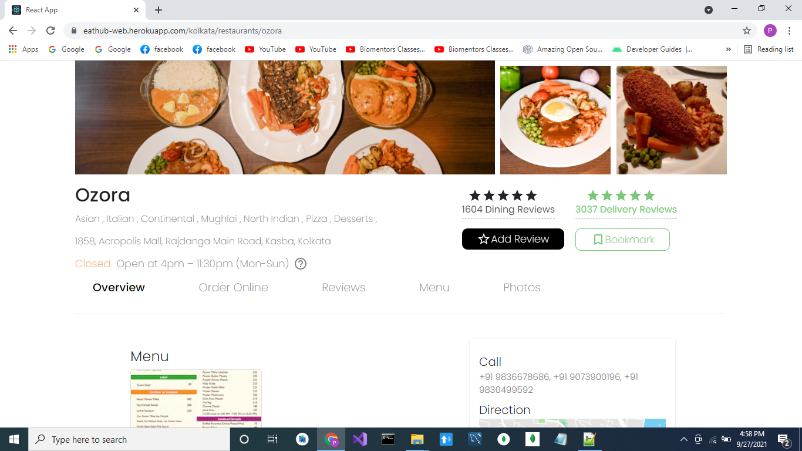
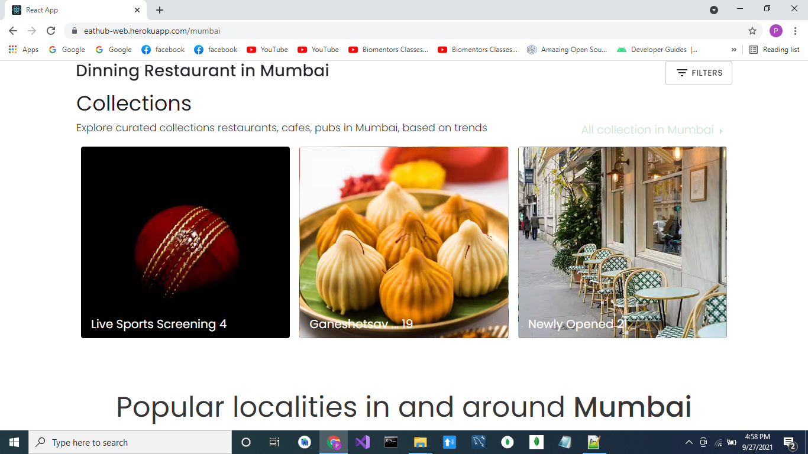
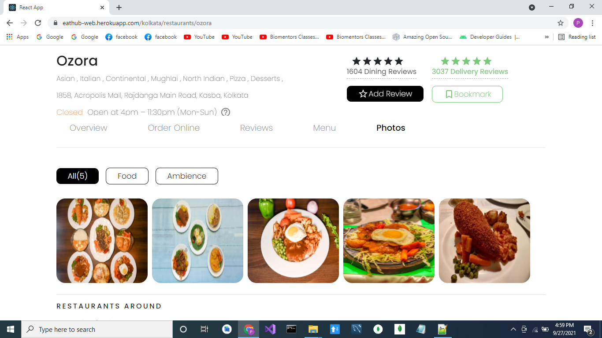
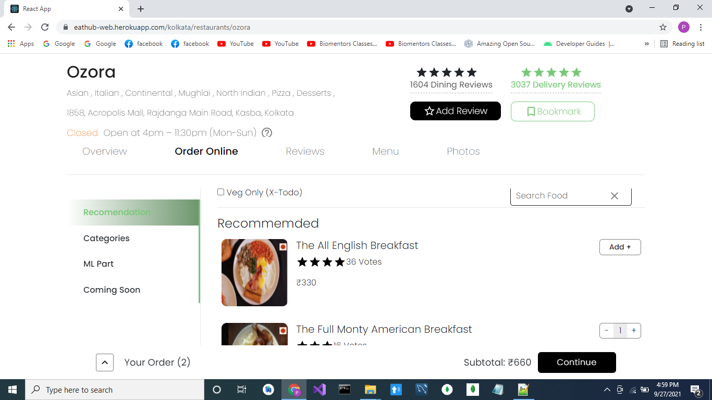
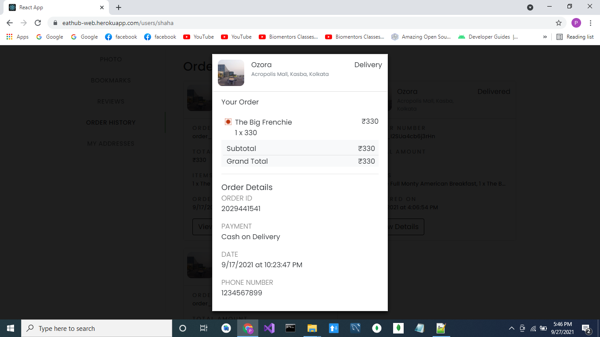
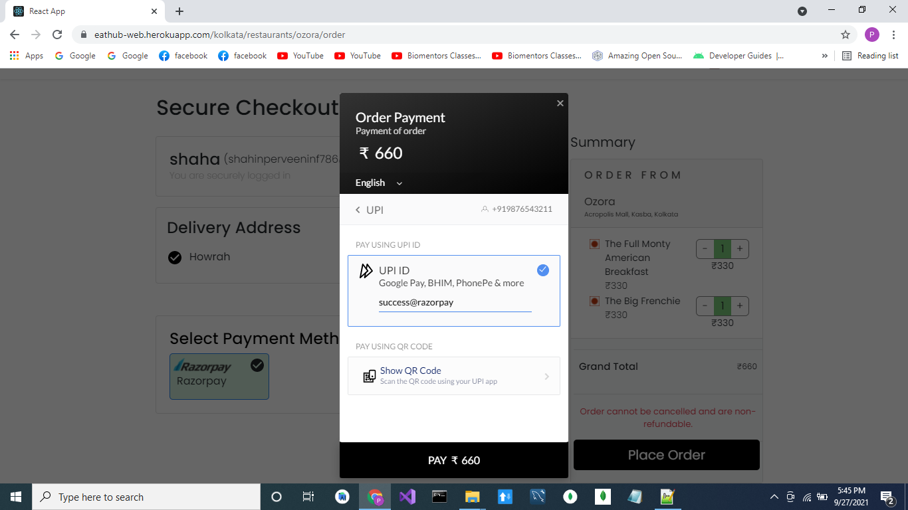

# `Restaurant Product`
(this is in active development)

User can order food online , search for popular restaurants near with filters based on cuisines,rating etc , sort them based on popularity, cost etc. 
Needs to `sign in` or `sign up` before checkout.

Test Credentials : 
use this to login, if you are concern about your privacy :)

email -- qwerty@gmail.com 
otp -- 12345
test upi payment -- success@razorpay (select upi option and paste this).

[Live Link] (https://eathub-web.herokuapp.com)

#### Screenshots

[Video Demo](https://drive.google.com/drive/folders/1dZaKBAjIGcfNY4KzM6MzZTvePWZ79kev?usp=sharing)

<table>
   <tr align=center>
     <td  colspan=3>Home Page </td>
  </tr>
  <tr>
    <td>Restaurant Page </td>
    <td>Collection Page </td>
    <td>Profile Update Page</td>
  <tr>
   <td>Profile Update Page</td>
     <td>Profile Update Page</td>
   <td>Profile Update Page</td>
  </tr>
</table>

## Built With

<table  align=center>
  <tr>
   <td align=center> </td>
    <td align=center> </td>
    <td align=center> </td>
	<td align=center> </td>
     <td align=center> </td>
     
  </tr>

</table>

### `Overview of Tech stack`

- Google Maps & Mapbox  for geo coding
- RazorPay  for Payment
- Redux for managing state data between pages.

### `Installation and Setup Instructions`

-Clone down this repository. You will need `node` and `npm` installed globally on your machine.
-Installation:`npm install`
-To Run Test Suite:`npm test`
-To Start Server: `npm start`
-To Visit app locally: `localhost:3000/`

### `Deployement`

deployement tool used: Heroku

### `Ongoing development`
Dashboard for restaurant owner & onboard new restaurants.

## 🤝 Contributing

Contributions & feedbacks are welcome!

## Show your support

Give a ⭐️ if you like this project!

